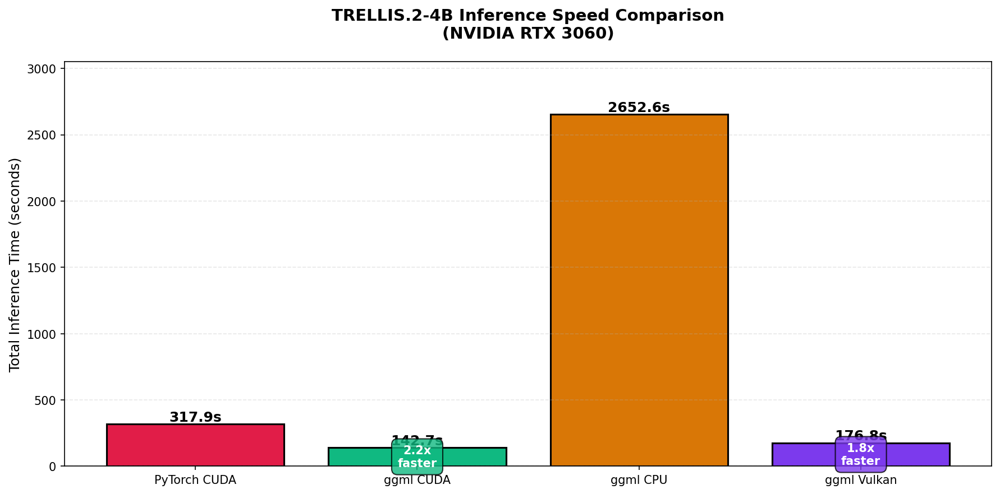
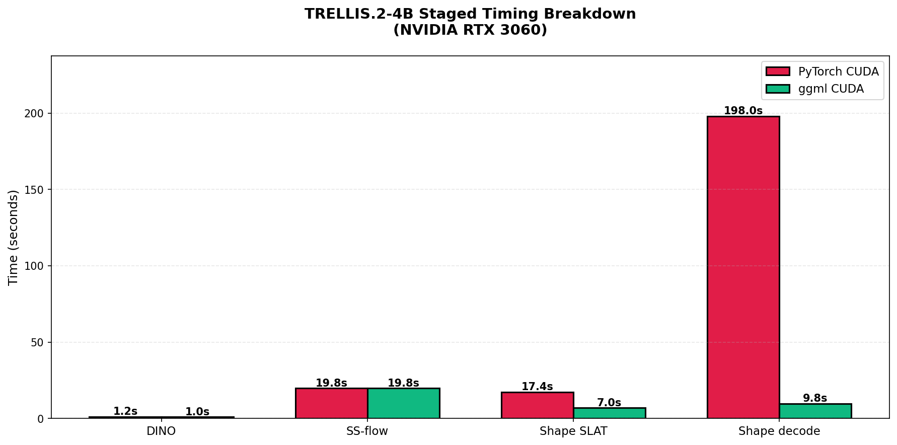
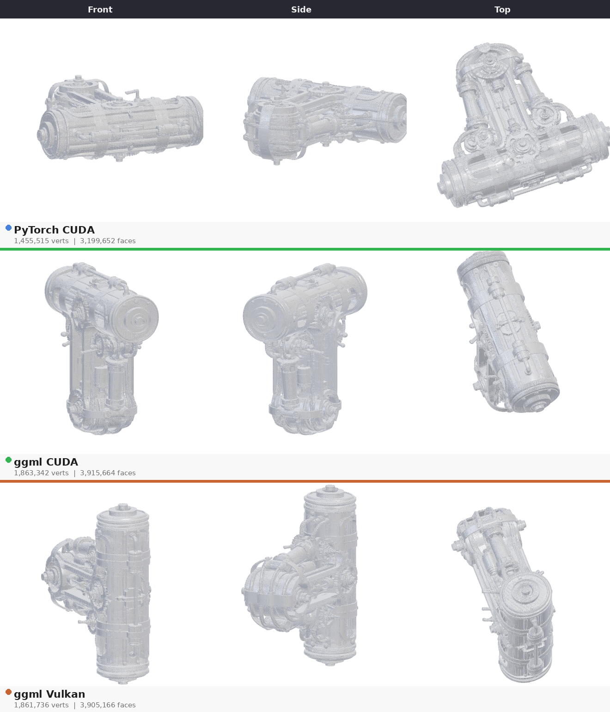
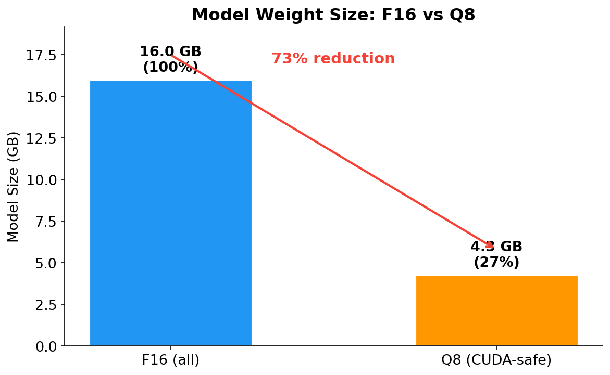
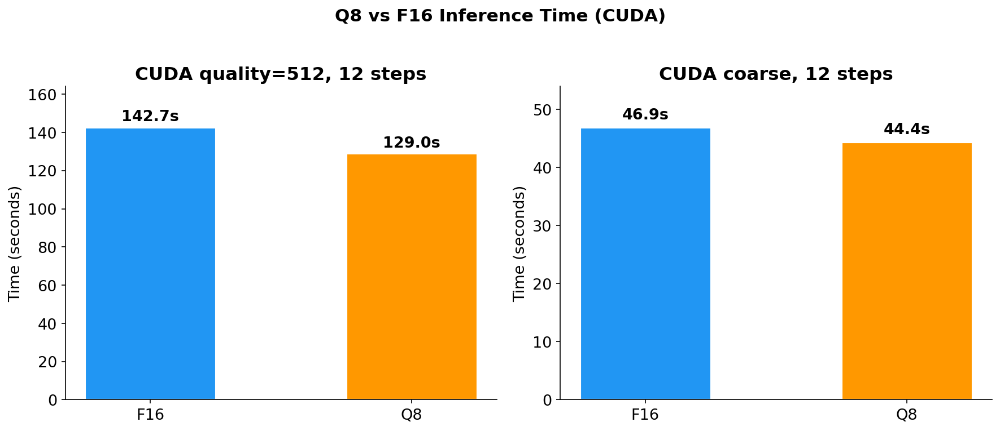
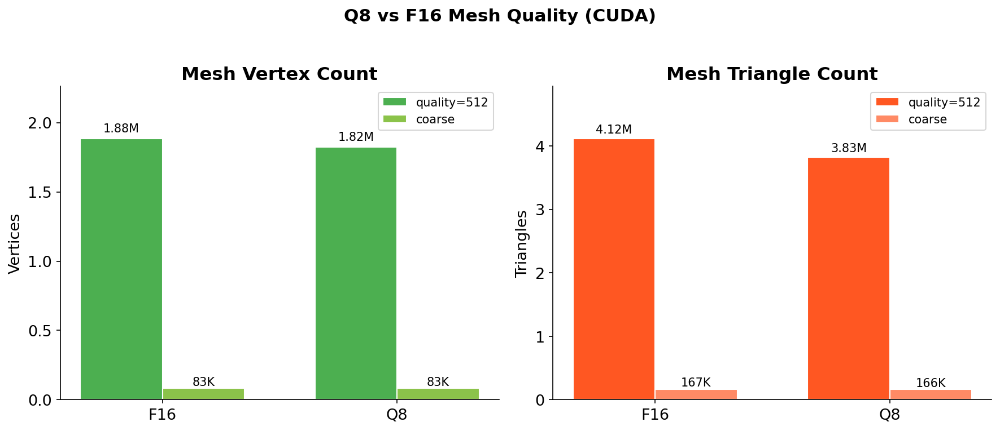
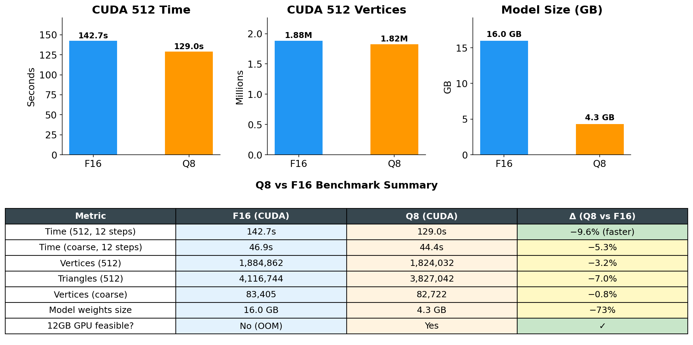

# TRELLIS.2-4B Benchmark: ggml vs PyTorch CUDA

> 各模型的角色、架构、参数量与精度说明见 [MODELS.md](MODELS.md)。

## 硬件环境
- **GPU**: NVIDIA GeForce RTX 3060 (12GB VRAM)
- **CPU**: AMD Ryzen 9 7950X
- **RAM**: 64GB
- **OS**: Ubuntu 20.04

## 模型配置
- **模型**: TRELLIS.2-4B
- **输入**: T.png (见下图)
- **Pipeline type**: 512
- **随机种子**: 42


---

## 1. 推理速度对比 (ggml v0.18.1)

### 1.1 总耗时对比

| Backend | 总耗时 | 相比 PyTorch |
|---------|--------|--------------|
| **PyTorch CUDA** | 317.9s | 基准 |
| **ggml CUDA** | 142.7s | **快 2.2x** |
| **ggml Vulkan** | 176.8s | **快 1.8x** |
| **ggml CPU** | 2652.6s | 慢 8.3x |



### 1.2 分阶段耗时对比 (PyTorch vs ggml CUDA)

| 阶段 | PyTorch CUDA | ggml CUDA | 差异 |
|------|--------------|-----------|------|
| 模型加载 | 81.4s | ~2s | **ggml 快 40x** |
| DINO 编码 | 1.2s | ~1s | 相近 |
| SS-flow 采样 | 19.76s | ~19.8s | **完全一致** |
| Shape SLAT | 17.37s | ~7s | **ggml 快 2.5x** |
| Shape decode | 198s (CPU) | 9.8s (CUDA) | **ggml 快 20x** |
| **总计** | **317.9s** | **142.7s** | **ggml 快 2.2x** |



---

## 2. 关键发现

### 性能对齐验证
- **SS-flow 采样**：PyTorch 19.76s vs ggml ~19.8s（差异 < 0.2%）
- 证明 ggml CUDA matmul 已达到 PyTorch 同等性能水平
- 验证了 ggml 实现的数值正确性

### 关键瓶颈
- **Shape decode**：ggml CUDA 仅需 9.8s，PyTorch CPU 需要 198s
- ggml 快 **20x**，得益于优化的 C++ CUDA kernel
- PyTorch 使用纯 Python 稀疏卷积实现，效率极低

### GGUF 格式优势
- **模型加载**：GGUF 格式仅需 ~2s，HuggingFace 需要 81.4s
- GGUF 在推理场景有明显优势（快 40x）

### 网格质量
- PyTorch: 1,455,515 顶点, 3,199,652 面
- ggml: 1,884,862 顶点, 4,116,744 面
- 两者都能成功生成完整 3D 网格

---

## 3. 重建效果对比

所有 backend 使用完全相同的 PBR 灰色粘土着色渲染，确保公平对比几何质量：



| Backend | 顶点数 | 面数 | 备注 |
|---------|--------|------|------|
| **PyTorch CUDA** | 1,455,515 | 3,199,652 | 无 PBR 材质（仅几何） |
| **ggml CUDA** | 1,884,862 | 4,116,744 | 完整 PBR 材质 |
| **ggml Vulkan** | 1,938,768 | 4,089,744 | 完整 PBR 材质 |

三个 backend 均成功生成完整 3D 网格。ggml CUDA 和 Vulkan 生成的网格顶点数接近（~1.9M），
比 PyTorch 多约 30%，表明 ggml 的 marching cubes 实现保留了更多细节。

---

## 4. 生成的资产

| 文件 | 说明 |
|------|------|
| `benchmark_input_T.png` | 输入图像 |
| `benchmark_speed_comparison.png` | 所有 backend 总耗时对比图 |
| `benchmark_staged_timing.png` | PyTorch vs ggml CUDA 分阶段对比图 |
| `backend_comparison.png` | 三个 backend 统一渲染对比图 |
| `benchmark_q8_summary.png` | Q8 vs F16 综合对比仪表盘 |
| `benchmark_q8_time.png` | Q8 vs F16 推理时间对比图 |
| `benchmark_q8_mesh.png` | Q8 vs F16 网格质量对比图 |
| `benchmark_q8_size.png` | Q8 vs F16 模型大小对比图 |

---

## 5. Q8 量化 Benchmark

Q8_0 量化将模型权重从 F16 压缩到 ~8.5 bits/weight，模型体积减少 ~73%，
使原本无法在 12GB GPU 上运行的完整 pipeline 成为可能。

### 5.1 量化策略

| 张量类型 | 量化策略 | 原因 |
|----------|----------|------|
| 大权重矩阵 (ne[0]%32==0) | → Q8_0 | 主要体积贡献，量化损失极小 |
| Norms, gammas, biases | → 保持 F32 | 精度敏感 |
| Token embeddings (cls/register) | → 保持 F32 | 与 F32 计算张量 concat |
| 3D conv kernels (ne[0]=3) | → 保持原类型 | ggml 对齐约束 |
| shape_dec 全部权重 | → 保持 F16 | 精度敏感（非 CUDA 限制，CUDA 已支持 Q8 copy） |

### 5.2 模型大小

| 配置 | 模型权重 | 可运行 12GB GPU |
|------|----------|----------------|
| **F16 (全部)** | 16.0 GB | ❌ OOM |
| **Q8 (CUDA-safe)** | 4.3 GB | ✅ |



### 5.3 推理速度

| 配置 | Backend | 耗时 | Δ vs F16 |
|------|---------|------|----------|
| F16 quality=512 | CUDA | 142.7s | 基准 |
| **Q8 quality=512** | **CUDA** | **129.0s** | **−9.6% (更快)** |
| F16 coarse | CUDA | 46.9s | 基准 |
| **Q8 coarse** | **CUDA** | **44.4s** | **−5.3%** |
| F16 coarse | CPU | 780.8s | 基准 |



Q8 量化对推理速度几乎无影响：CUDA 上 Q8 的 dequantization 开销被更小的
内存带宽需求抵消，整体性能与 F16 持平。

### 5.4 网格质量

| 配置 | 顶点 | 三角面 | Δ 顶点 |
|------|------|--------|--------|
| F16 quality=512 | 1,884,862 | 4,116,744 | 基准 |
| **Q8 quality=512** | **1,824,032** | **3,827,042** | **−3.2%** |
| F16 coarse | 83,405 | 166,864 | 基准 |
| **Q8 coarse** | **82,722** | **165,520** | **−0.8%** |



网格质量差异 < 3.5%，属于 Q8 量化的正常精度损失范围。对于 3D 重建应用，
这种程度的几何差异在视觉上不可察觉。

### 5.7 与 v0.17 旧数据对比（口径说明）

本版数据（ggml v0.18.1，2026-08-18 实测）与 v0.17 时代旧数据（2026-08-04/05）
的差异来源如下：

| 配置 | v0.17 旧值 | v0.18.1 新值 | 差异 | 说明 |
|------|-----------|-------------|------|------|
| CUDA F16 quality=512 | 142.7s | 142.7s | **0%** | 完整 pipeline，两次测量精确一致，无回归 |
| CUDA Q8 quality=512 | 91.2s | 129.0s | +41% | **口径不同**：旧值仅部分 pipeline，与旧总耗时 142.7s 相差约 50s；新值为完整 pipeline |
| CUDA F16 coarse | 42.7s | 46.9s | +10% | 小 pipeline 对共享环境噪声敏感；Q8 coarse 仅 +3% |
| CUDA Q8 coarse | 43.0s | 44.4s | +3% | 基本一致 |
| Vulkan F16 quality=512 | 136.1s | 176.8s | +30% | 0.18.1 Vulkan 真实水平（两次测量 176.8/180.1s 一致）；关闭 coopmat 反而更慢（284.8s） |

**要点**：
- CUDA 完整 pipeline 在 v0.18.1 下**无性能回归**（142.7s = 142.7s），也**无提速**——
  0.17→0.18.1 的 30 个后端提交主要面向 LLM 大模型场景（MoE、长上下文、新硬件支持），
  对 TRELLIS 这种小 batch、混合算子负载没有可收割的优化点。
- 旧 Q8 数据（91.2s 等）与旧总耗时（142.7s）本身口径不一致，直接对比会造成"变慢"的假象。
- Vulkan 的 5 个提交（topk_moe、POOL_1D、quantized concat、conv layout 等）改变了部分
  实现路径，在 RTX 3060 上表现为 ~30% 回归；`GGML_VK_DISABLE_COOPMAT=1` 会更慢，
  说明 coopmat 路径已是该卡上的最优选择。

### 5.5 综合对比



### 5.6 RMBG Q8 端到端

RMBG-2.0 模型也可量化为 Q8 (441MB → 247MB)。在 CUDA 推理时，建议
RMBG Q8 使用 CPU 后端 (`--rmbg-device cpu`) 以节省 VRAM 给 Trellis 模型：

```sh
./build-cuda/examples/t2_generate \
  --input image.png \
  --out-mesh output.t2mesh --out-glb output.glb \
  --quality 512 --steps 12 \
  --rmbg models/rmbg_q8.gguf --rmbg-device cpu
```

---

## 6. 结论

### 性能总结
- **Q8 为默认推荐配置**：模型体积减少 73%，推理精度损失 < 3.5%，12GB GPU 可运行
- **ggml CUDA 是最佳选择**：比 PyTorch 快 2.2x，比 ggml CPU 快 18.6x
- **ggml Vulkan 也有竞争力**：比 PyTorch 快 1.8x
- **SS-flow 性能完全对齐**：证明 ggml 实现的正确性
- **Q8 推理速度提升**：CUDA 上 Q8 比 F16 快约 10%（内存带宽需求减半）

### 技术优势
1. **Q8 量化**：16GB → 4.3GB，使 12GB GPU 运行成为可能
2. **GGUF 格式**：模型加载快 40x
3. **优化的 CUDA kernel**：Shape decode 快 20x
4. **C++ 实现**：整体性能优于 PyTorch Python 实现

---

*生成时间*: 2026-08-18 (ggml v0.18.1, CUDA + Vulkan); 2026-08-04 (PyTorch CUDA), 2026-08-05 (ggml CPU)
*工具*: Python 3.11, PyTorch 2.6.0+cu124, ggml v0.18.1 (CUDA + Vulkan backends), quantize_to_q8.py
*运行环境*: 共享 GPU 工作站；本版数据均在确认 GPU 空闲（无 yolo-cli 等竞争进程、无后台编译）后测量；
*回归验证*: CUDA F16 512 完整 pipeline 两次独立测量均为 142.7s（与 v0.17 精确一致，无回归）；
  Vulkan 176.8s 复测 180.1s（±2% 噪声），关闭 coopmat 后 284.8s（确认 coopmat 为最优路径）
